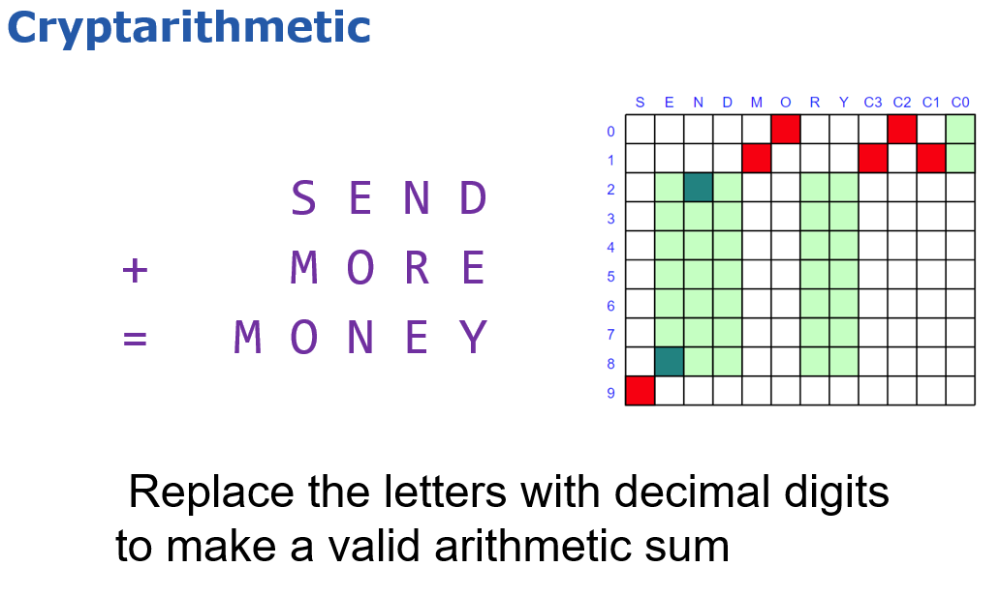
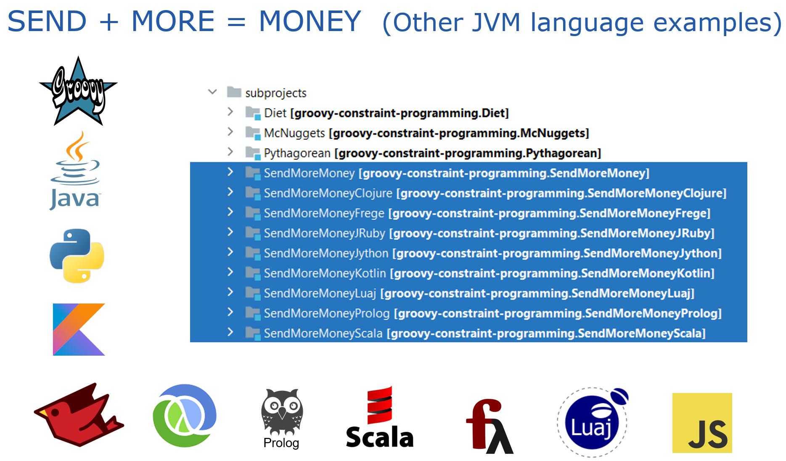
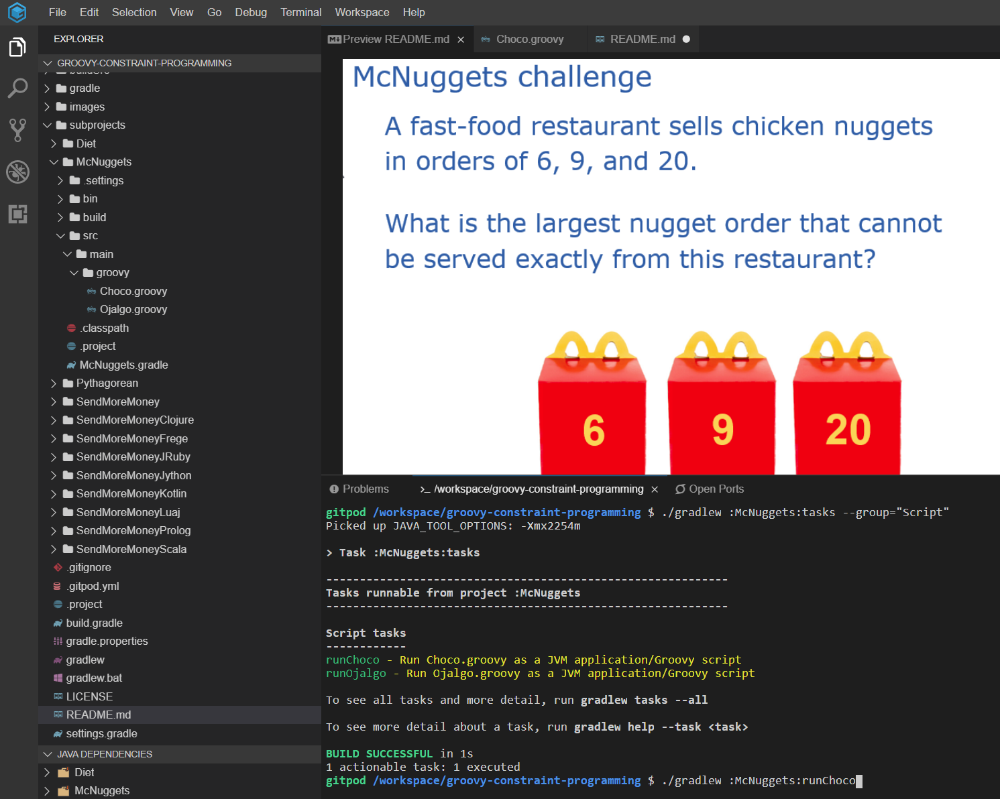

# Groovy Constraint Programming

This repo contains examples from an Introduction to Constraint Programming talk:
https://speakerdeck.com/paulk/groovy-constraint-programming

---

The [Pythagorean subproject](subprojects/Pythagorean/)
is an intro example comparing the imperative and constraint-programming styles (using Choco[1]).


Run via Jupyter/BeakerX:
[](https://mybinder.org/v2/gh/paulk-asert/groovy-constraint-programming/master?filepath=subprojects%2FPythagorean%2Fsrc%2Fmain%2Fnotebook%2FPythagorean.ipynb)


---

The [SendMoreMoney subproject](subprojects/SendMoreMoney/)
illustrates solving a fairly simple cryptarithmetic puzzle
using naive brute force, permutations, and constraint-programming with Choco[1].



Examples for this problem are also provided for
[Clojure](https://clojure.org/),
Haskell ([Frege](https://github.com/Frege/frege)),
[Java](https://www.java.com/),
JavaScript ([Nashorn](https://docs.oracle.com/javase/10/nashorn/)),
Ruby ([JRuby](https://www.jruby.org/)), 
Python ([Jython](https://www.jython.org/)),
[Kotlin](https://kotlinlang.org/),
Lua ([Luaj](https://github.com/luaj/luaj)),
Prolog ([tuprolog](http://apice.unibo.it/xwiki/bin/view/Tuprolog/)),
and [Scala](https://www.scala-lang.org/).



---

The [McNuggets subproject](subprojects/McNuggets/)
illustrates solving a fairly simple Frobenius numbers puzzle
using Choco[1] and Ojalgo[2].


---

The [Diet subproject](subprojects/Diet/)
illustrates solving an optimization/linear programming problem
using
Apache Commons Math[3],
Choco[1] (with and without ibex integration),
Jacop[4] (using scalar-product/weighted-sum and knapsack algorithms),
Ojalgo[2],
OptaPlanner[5],
OrTools[6],
and SAS/OR[7].
The slides also show solving this example using Excel and Google sheets.


---

Libraries used:

1. https://choco-solver.org/
2. https://www.ojalgo.org/
3. https://commons.apache.org/proper/commons-math/
4. https://github.com/radsz/jacop
5. https://www.optaplanner.org/
6. https://developers.google.com/optimization
7. https://www.sas.com/en_us/software/or.html (commercial product)

---

## Running the examples

### Running locally

Clone the repo. You can then run scripts from the command-line (various gradle tasks
have been defined to make this easy) or within your favorite IDE.

Details for cloning and showing available gradle tasks:

<details open>
<summary>Linux/MacOS</summary>

```
$ git clone https://github.com/paulk-asert/groovy-constraint-programming.git
...
$ ./gradlew tasks
```
</details>
<details>
<summary>Windows</summary>

Assuming you have git installed:

```
> git clone https://github.com/paulk-asert/groovy-constraint-programming.git
...
> gradlew tasks
```
</details>

Make sure you have Java installed prior to running the examples.

Alternatively, run any of the scripts directly in the IDE.


### Running via Gitpod

[](https://gitpod.io/#https://github.com/paulk-asert/groovy-constraint-programming)

To run via gitpod. Click on the Gitpod button on the github site.
Once loaded, run one of the available script tasks. To find
available script tasks you can try something like:

```
> ./gradlew :McNuggets:tasks --group="Scripts"
```

You should see something like below:


And you can run a script with something like:
```
> ./gradlew :McNuggets:runChoco
```

With the following result:


### Running via Jupyter/BeakerX

Some of the examples have links (look out for ) to run as a Jupyter/BeakerX notebook. Output will be similar to below:

