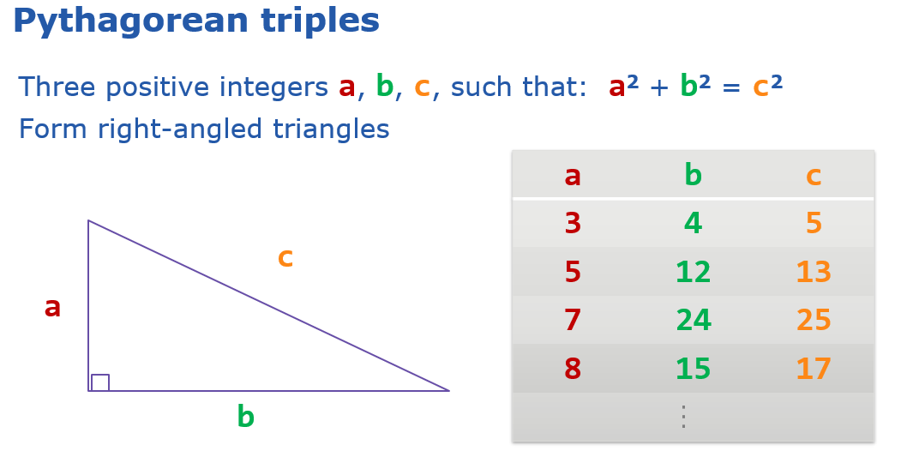

# Groovy Constraint Programming

This repo contains examples from an Introduction to Constraint Programming talk:

https://speakerdeck.com/paulk/groovy-constraint-programming

You have 4 options to run the examples:

* [running locally](docs/RunningLocal.md) on the command-line or in an IDE
* [running via gitpod](docs/RunningGitpod.md)
* [running as a Jupyter/BeakerX](docs/RunningBeakerX.md) notebook
* [running in the Groovy Console or Groovy Web Console](docs/RunningConsole.md)

---

The [Pythagorean subproject](subprojects/Pythagorean/)
is an intro example comparing the imperative and constraint-programming styles (using Choco[1]).

Run via Jupyter/BeakerX:

---

The [SendMoreMoney subproject](subprojects/SendMoreMoney/)
illustrates solving a fairly simple cryptarithmetic puzzle
using naive brute force, permutations, and constraint-programming with Choco[1].

Examples for this problem are also provided for
[Clojure](https://clojure.org/),
Haskell ([Frege](https://github.com/Frege/frege)),
[Java](https://www.java.com/),
JavaScript ([Nashorn](https://docs.oracle.com/javase/10/nashorn/)),
Ruby ([JRuby](https://www.jruby.org/)), 
Python ([Jython](https://www.jython.org/)),
[Kotlin](https://kotlinlang.org/),
Lua ([Luaj](https://github.com/luaj/luaj)),
Prolog ([tuprolog](http://apice.unibo.it/xwiki/bin/view/Tuprolog/)),
and [Scala](https://www.scala-lang.org/).

---

The [McNuggets subproject](subprojects/McNuggets/)
illustrates solving a fairly simple Frobenius numbers puzzle
using Choco[1] and Ojalgo[2].

---

The [Diet subproject](subprojects/Diet/)
illustrates solving an optimization/linear programming problem
using
Apache Commons Math[3],
Choco[1] (with and without ibex integration),
Jacop[4] (using scalar-product/weighted-sum and knapsack algorithms),
Ojalgo[2],
OptaPlanner[5],
OrTools[6],
and SAS/OR[7].
The slides also show solving this example using Excel and Google sheets.

---

Libraries used:

1. https://choco-solver.org/
2. https://www.ojalgo.org/
3. https://commons.apache.org/proper/commons-math/
4. https://github.com/radsz/jacop
5. https://www.optaplanner.org/
6. https://developers.google.com/optimization
7. https://www.sas.com/en_us/software/or.html (commercial product)

---
