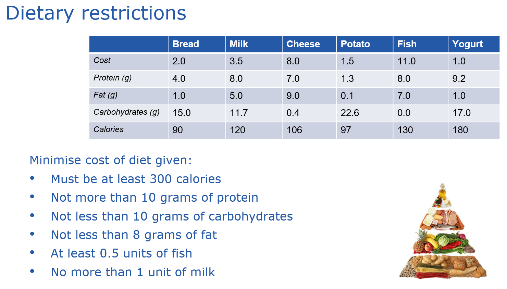

# Groovy Constraint Programming

This repo contains examples from an Introduction to Constraint Programming talk:

https://speakerdeck.com/paulk/groovy-constraint-programming

You have 4 options to run the examples:

* [running locally](docs/RunningLocal.md) on the command-line or in an IDE
* [running via gitpod](docs/RunningGitpod.md)
* [running as a Jupyter/BeakerX](docs/RunningBeakerX.md) notebook
* [running in the Groovy Console or Groovy Web Console](docs/RunningConsole.md)

---

The [Pythagorean subproject](subprojects/Pythagorean/)
is an introductory example comparing an imperative style solution (using a brute-force approach), and
a constraint-programming solution (using Choco[1]).


Run Choco solution via Jupyter/BeakerX:
[](https://mybinder.org/v2/gh/paulk-asert/groovy-constraint-programming/master?filepath=subprojects%2FPythagorean%2Fsrc%2Fmain%2Fnotebook%2FPythagorean.ipynb)

Command-line arguments for Gradle to run the script:
`:Pythagorean:run`

---

## Cryptarithmetic puzzles

This example solves a classic cryptarithmetic puzzle using constraint programming.
The Groovy solution is contrasted with brute-force approaches and solutions in other JVM languages.


See the [SendMoreMoney subproject](subprojects/SendMoreMoney/) for all the details.

---

The [McNuggets subproject](subprojects/McNuggets/)
illustrates solving a fairly simple Frobenius numbers puzzle
using Choco[1] and Ojalgo[2].


Command-line arguments for Gradle to see the task names for the available solutions:
```
:McNuggets:tasks --group="Script"
```
Then pick one of those tasks to run, e.g. to run the Ojalgo solution:
```
:McNuggets:runOjalgo
```

---

The [Diet subproject](subprojects/Diet/)
illustrates solving an optimization/linear programming problem
using
Apache Commons Math[3],
Choco[1] (with and without ibex integration),
Jacop[4] (using scalar-product/weighted-sum and knapsack algorithms),
Ojalgo[2],
OptaPlanner[5],
OrTools[6],
and SAS/OR[7].
The slides also show solving this example using Excel and Google sheets.



Command-line arguments for Gradle to see the task names for the available solutions:
```
:Diet:tasks --group="Script"
```
Then pick one of those tasks to run, e.g. to run the Apache Commons Math solution:
```
:Diet:runDietCommonsMath
```

---

Libraries used:

1. https://choco-solver.org/
2. https://www.ojalgo.org/
3. https://commons.apache.org/proper/commons-math/
4. https://github.com/radsz/jacop
5. https://www.optaplanner.org/
6. https://developers.google.com/optimization
7. https://www.sas.com/en_us/software/or.html (commercial product)

---
